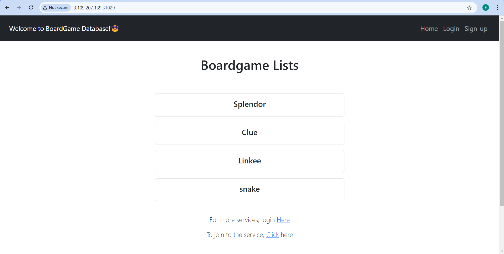
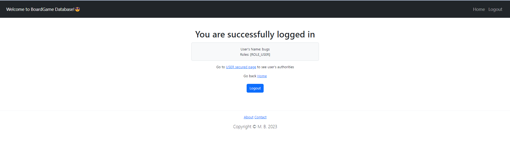
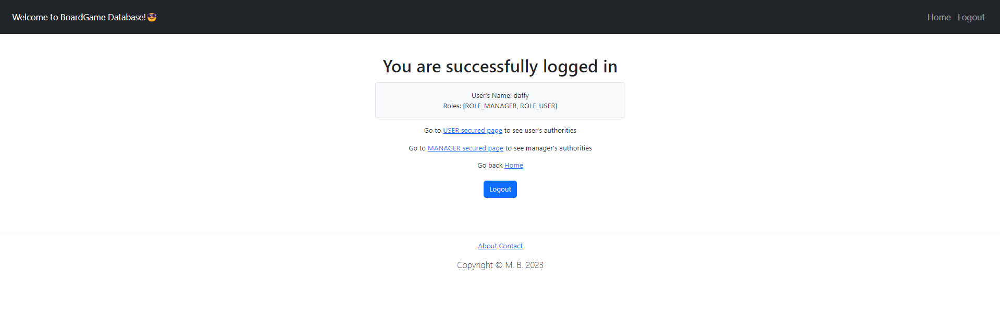
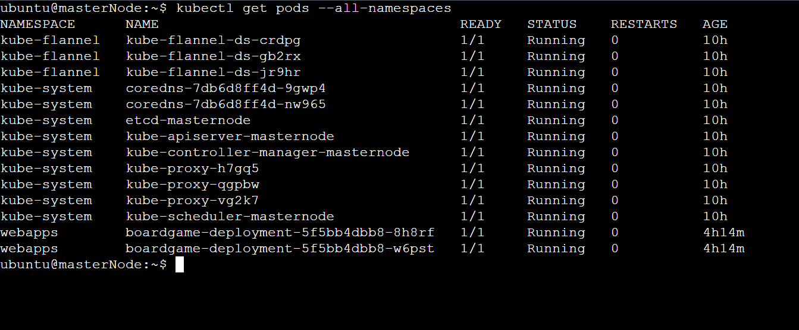

# BoardGame DevSecOps Project.


<div align="center">
  
  
  <br>
  
    
  <br>
  
  
</div>


# Setup Multi Node K8-Cluster using kubeadm [K8 Version-->1.28.1]
## Step-1 --> Create 3 ubuntu t2.large machine with 15GB of Storage.
###### Enable the port number 6443 in sg group of AWS .
-> Before starting the installation process, ensure that the following prerequisites are met:
. You have at least two Ubuntu 18.04 or higher servers available for creating the cluster
. Each server has at least 2GB of RAM and 2 CPU cores.
. The servers have network connectivity to each other
. You have root access to each server.  

##### Installation Steps :->


###### Run this command on all the 3 machine.
1. Update the System Packages and install the necessary dependencies using the following commands:
```
sudo apt-get update
sudo apt install apt-transport-https curl -y
```

2. Install the containerd in your system for k8s.
```
sudo mkdir -p /etc/apt/keyrings
curl -fsSL https://download.docker.com/linux/ubuntu/gpg | sudo gpg --dearmor -o /etc/apt/keyrings/docker.gpg
echo "deb [arch=$(dpkg --print-architecture) signed-by=/etc/apt/keyrings/docker.gpg] https://download.docker.com/linux/ubuntu $(lsb_release -cs) stable" | sudo tee /etc/apt/sources.list.d/docker.list > /dev/null
sudo apt-get update
sudo apt-get install containerd.io -y
```
3. Create containerd configuration
```
sudo mkdir -p /etc/containerd
sudo containerd config default | sudo tee /etc/containerd/config.toml
```

4. Edit /etc/containerd/config.toml
```
sudo nano /etc/containerd/config.toml
```
Modify the SystemdCgroup false to true --> 'SystemdCgroup = true' like this.

or use this.
```
sudo sed -i -e 's/SystemdCgroup = false/SystemdCgroup = true/g' /etc/containerd/config.toml
```

5. Restart the containerd:

```
sudo systemctl restart containerd
```
6. Install Kubernetes
```
curl -fsSL https://pkgs.k8s.io/core:/stable:/v1.30/deb/Release.key | sudo gpg --dearmor -o /etc/apt/keyrings/kubernetes-apt-keyring.gpg
echo 'deb [signed-by=/etc/apt/keyrings/kubernetes-apt-keyring.gpg] https://pkgs.k8s.io/core:/stable:/v1.30/deb/ /' | sudo tee /etc/apt/sources.list.d/kubernetes.list
sudo apt-get update
sudo apt-get install -y kubelet kubeadm kubectl
sudo apt-mark hold kubelet kubeadm kubectl
sudo systemctl enable --now kubelet
```
7. Disable swap
```
sudo swapoff -a
```
8. If there are any swap entries in the /etc/fstab file, remove them using a text editor such as nano:
```
sudo nano /etc/fstab
```
9. Enable kernel modules
```
sudo modprobe br_netfilter
```

10. Add some settings to sysctl
```
sudo sysctl -w net.ipv4.ip_forward=1
```


###### Run the below command on master node only.

#### 1.Initialize the Cluster (Run only on master)
```
sudo kubeadm init --pod-network-cidr=10.244.0.0/16
```
2. Create a .kube directory in your home directory:
```
mkdir -p $HOME/.kube
```
3. Copy the Kubernetes configuration file to your home directory:
```
sudo cp -i /etc/kubernetes/admin.conf $HOME/.kube/config
```

4.Change ownership of the file:
```
sudo chown $(id -u):$(id -g) $HOME/.kube/config
```
5. Install Flannel
```
kubectl apply -f https://github.com/flannel-io/flannel/releases/latest/download/kube-flannel.yml
```

6.Verify Installation
```
kubectl get pods --all-namespaces
```

### Join Nodes
To add nodes to the cluster, run the kubeadm join command with the appropriate arguments on each node. The command will output a token that can be used to join the node to the cluster.

##### kubeadm token 
```
kubeadm join 172.31.1.224:6443 --token jegym7.4avqhna1gf5t6998 \
        --discovery-token-ca-cert-hash sha256:df287cb10ed77d85e7e44df5668751edbd7cd9db72c7013e521114bb469b2dc3
```
You will get like this after initialization of cluster (In step 1 on the master node.) on master node and copy that and run that in node machine that you want to join.


### To Varify  upto here everything correct run the below command.

```
kubectl get pods --all-namespaces
```
<div align="center">
  
</div>

```
kubectl get nodes
```


#######                                                       K8s Part Done              


### Installation of Jenkins.
1. Create a ubuntu t2.large with 20GB storage space machine.
2. Execute the below steps.
```
sudo apt update
sudo apt install fontconfig openjdk-17-jre
java -version
openjdk version "17.0.8" 2023-07-18
OpenJDK Runtime Environment (build 17.0.8+7-Debian-1deb12u1)
OpenJDK 64-Bit Server VM (build 17.0.8+7-Debian-1deb12u1, mixed mode, sharing)

#jenkins
sudo wget -O /usr/share/keyrings/jenkins-keyring.asc \
https://pkg.jenkins.io/debian-stable/jenkins.io-2023.key
echo deb [signed-by=/usr/share/keyrings/jenkins-keyring.asc] \
https://pkg.jenkins.io/debian-stable binary/ | sudo tee \
/etc/apt/sources.list.d/jenkins.list > /dev/null
sudo apt-get update
sudo apt-get install jenkins
sudo systemctl start jenkins
sudo systemctl enable jenkins
```

### Access the application in --> publicIP:8080 and Change the password.

3. Install the below mentioned plugins in the jenkins. (Goto Manage Jenkins →Plugins → Available Plugins →)
   1. Eclipse Temurin Installer (Install without restart)
   2. SonarQube Scanner (Install without restart)
   3. Docker
   4. k8s
   5. maven
   6. Config File Provider Plugin
   7. Maven Integration plugin

4 . Add below mentioned credential in the jenkins.

```
1.jenkinsAgent only for master-agent node config of jenkins no need here.
2.sonar-cred , add sonar token
3.git-cred , through username and password(git-token) of github (only for private Repo)
4.docker-cred , through username and password (docker-token)
5.k8s-cred  , kubernetes cluster-name and secrete(password) or (below somewhere documented)
6.gmail-cred  , through username and password(gmail-token)
```

#### Install Docker and Trivy on Jenkins Machine
###### Docker Installation 
```
sudo apt-get update
sudo apt-get install docker.io -y
sudo usermod -aG docker $USER  # Replace with your system's username, e.g., 'ubuntu'
newgrp docker
sudo chmod 777 /var/run/docker.sock
```

###### Trivy Installtion
```
sudo apt-get install wget apt-transport-https gnupg lsb-release
wget -qO - https://aquasecurity.github.io/trivy-repo/deb/public.key | sudo apt-key add -
echo deb https://aquasecurity.github.io/trivy-repo/deb $(lsb_release -sc) main | sudo tee -a /etc/apt/sources.list.d/trivy.list
sudo apt-get update
sudo apt-get install trivy        
```

#### If You face docker login error try to execute below steps on jenkins machine.
```
sudo usermod -aG docker jenkins
sudo systemctl restart jenkins
```

###### In AWS SG open the below mentioned port number as shown in Image. And Use same Security group for all the instances while doing project.


### Create a 2 more t2.large with 20GB storage space ubuntu machine for SonarQube and Nexus Repository.

###### Install The SonarQube with docker Image.
1. Install docker and update the system using above command. and After this execute the below command
```
docker run -d --name sonar -p 9000:9000 sonarqube:lts-community
```
2. Access this --> PublicIP:9090 and you will get like this. And use 'admin' as a username and password for 1st. And Change to new one.


###### Install The Nexus with docker Image.
1. Install docker and update the system using above command. and After this execute the below command
```
docker run -d --name Nexus -p 8081:8081 sonatype/nexus3
```
2. Access this --> PublicIP:9090 and you will get like this. And use 'admin' as a username adn for password follow as shown in 2nd image. for 1st. And Change to new one.


###### Password for Nexus


##### In Sonar create token , copy that and create sonar-cred in jenkins
Administration -> Security -> User -> click on token.

#### For Nexus to create a credential in Jenkins follow below steps
Dashboard -> Manage Jenkins -> Managed files -> Add a new Config -> Global Maven settings.xml -> (Give any Name) -> Next. --> In Content uncomment and do this.
```
<server>
      <id>maven-releases</id>
      <username>admin</username>
      <password>admin123</password>
</server>

<server>
      <id>maven-snapshots</id>
      <username>admin</username>
      <password>admin123</password>
</server>

```
--> Submit. -> In POM.XML File do like this at end of file you find. 
```
<distributionManagement>
        <repository>
            <id>maven-releases</id>
            <url>http://3.110.191.207:8081/repository/maven-releases/</url>    # Copy the url of maven-releases and copy here.
        </repository>
        <snapshotRepository>
            <id>maven-snapshots</id>
            <url>http://3.110.191.207:8081/repository/maven-snapshots/</url>   # Copy the url of maven-snapshots and copy here.
        </snapshotRepository>
    </distributionManagement>
```

##### IN Jenkins Server Execute following command that Install the kubectl.
```
curl -o kubectl https://amazon-eks.s3.us-west-2.amazonaws.com/1.19.6/2021-01-05/bin/linux/amd64/kubectl
chmod +x ./kubectl
sudo mv ./kubectl /usr/local/bin
kubectl version --short --client
```

### Create Service Account, Role & Assign that role, And create a secret for Service Account and geenrate a Token.

##### Creating Service Account (svc.yaml)
```
apiVersion: v1
kind: ServiceAccount
metadata:
  name: jenkins
  namespace: webapps
```

Create a namespace 'webapps'
```
kubectl create namespace webapps
```

##### Create a Role. (role.yaml)
```
apiVersion: rbac.authorization.k8s.io/v1
kind: Role
metadata:
  name: app-role
  namespace: webapps
rules:
  - apiGroups:
        - ""
        - apps
        - autoscaling
        - batch
        - extensions
        - policy
        - rbac.authorization.k8s.io
    resources:
      - pods
      - secrets
      - componentstatuses
      - configmaps
      - daemonsets
      - deployments
      - events
      - endpoints
      - horizontalpodautoscalers
      - ingress
      - jobs
      - limitranges
      - namespaces
      - nodes
      - pods
      - persistentvolumes
      - persistentvolumeclaims
      - resourcequotas
      - replicasets
      - replicationcontrollers
      - serviceaccounts
      - services
    verbs: ["get", "list", "watch", "create", "update", "patch", "delete"]
```

##### Bind the role to service account (bind.yaml)
```
apiVersion: rbac.authorization.k8s.io/v1
kind: RoleBinding
metadata:
  name: app-rolebinding
  namespace: webapps 
roleRef:
  apiGroup: rbac.authorization.k8s.io
  kind: Role
  name: app-role 
subjects:
- namespace: webapps 
  kind: ServiceAccount
  name: jenkins
```

###### Generate token using service account in the namespace 'webapps' (sec.yaml)
```
apiVersion: v1
kind: Secret
type: kubernetes.io/service-account-token
metadata:
  name: mysecretname
  annotations:
    kubernetes.io/service-account.name: jenkins
```

At the end apply this yaml file.
```
kubectl apply -f svc.yaml
kubectl apply -f role.yaml 
kubectl apply -f bind.yaml
kubectl apply -f sec.yaml -n wenapps
```

#### You will get like this , follow the below steps as shown in image. Here you will get 'service endpoint  & clusterName'


#### To get the token. Copy the token and use in k8s-cred.
```
kubectl describe secret mysecretname -n webapps
```
 


## ----------------------------------- SetUp Monitoring For Our Application. --------------------------------------------.
Create the EC2 t2.large ubuntu machine with 30GB memory storage.

```
sudo apt update
```
#### Links to download Prometheus, Node_Exporter & black Box exporter . https://prometheus.io/download/

#### Links to download Grafana , https://grafana.com/grafana/download

#### Other link from video, https://github.com/prometheus/blackbox_exporter

## Prometheus.

```
wget https://github.com/prometheus/prometheus/releases/download/v2.54.1/prometheus-2.54.1.linux-amd64.tar.gz
```
```
ls
```
Extract the zip file.
```
tar -xvf prometheus-2.54.1.linux-amd64.tar.gz
```

rm tar file
```
rm prometheus-2.54.1.linux-amd64.tar.gz
```

```
cd prometheus-2.54.1.linux-amd64
```
Execute the .prometheus file to install the prometheus.
```
./prometheus &
```

###### Access the prometheus in 'publicIP:9090'


## Install the Grafana.
```
sudo apt-get install -y adduser libfontconfig1 musl
wget https://dl.grafana.com/enterprise/release/grafana-enterprise_11.2.0_amd64.deb
sudo dpkg -i grafana-enterprise_11.2.0_amd64.deb
```

###### Access the Grafana in 'publicIP:3000'


## Install the BlackBox Exporter
```
wget https://github.com/prometheus/blackbox_exporter/releases/download/v0.25.0/blackbox_exporter-0.25.0.linux-amd64.tar.gz
tar -xvf blackbox_exporter-0.25.0.linux-amd64.tar.gz
rm blackbox_exporter-0.25.0.linux-amd64.tar.gz
cd blackbox_exporter-0.25.0.linux-amd64
./blackbox_exporter
```
###### Access the  BlackBox Exporter in 'publicIP:9115'


## Install the Node_Exporter in Jenkins Server Machine.
```
wget https://github.com/prometheus/node_exporter/releases/download/v1.8.2/node_exporter-1.8.2.linux-amd64.tar.gz
tar -xvf node_exporter-1.8.2.linux-amd64.tar.gz
rm node_exporter-1.8.2.linux-amd64.tar.gz
cd node_exporter-1.8.2.linux-amd64
./node_exporter
```
###### Access the  Node_Exporter in 'publicIP:9115'


#### Add the job to a prometheus
```
sudo nano prometheus-2.54.1.linux-amd64/prometheus.yml 
```
###### And Configure like this 
```
scrape_configs:
  # The job name is added as a label `job=<job_name>` to any timeseries scraped from this config.
  - job_name: "prometheus"

    # metrics_path defaults to '/metrics'
    # scheme defaults to 'http'.

    static_configs:
      - targets: ["43.204.97.37:9090"]


  - job_name: 'node_exporter'
    static_configs:
      - targets: ['43.204.145.161:9100']

  - job_name: 'jenkins'
    metrics_path: '/prometheus'
    static_configs:
      - targets: ['43.204.145.161:8080']
  - job_name: 'blackbox'
    metrics_path: /probe
    params:
      module: [http_2xx]  # Look for a HTTP 200 response.
    static_configs:
      - targets:
        - http://prometheus.io    # Target to probe with http.
        - http://3.109.207.139:31029
    relabel_configs:
      - source_labels: [__address__]
        target_label: __param_target
      - source_labels: [__param_target]
        target_label: instance
      - target_label: __address__
        replacement: 43.204.97.37:9115  # The blackbox exporter's real hostname:port.
~                                                                                                                                                                                                               "prometheus.yml" 54L, 1695B                                                                       
```


Here replace with your respective 'publicIP'

```
pgrep prometheus
```
```
kill 2314   # 2314 is process id
```
```
./prometheus &
```
## After this your Prometheus looks like.


## ----------------------------------------------------- Grafana SetUp -------------------------------------------------------------
### Login to the Grafana  'publicIP:3000' and use 'admin' as the password and username. Change to a new one.
#### Import the Grafana Dashboard for the following 
1. Jenkins: Performance and Health Overview
2. Node Exporter Full
3. Prometheus Blackbox Exporter

   Dashaboard --> Import dashbord --> In ID section give the respective dashbord id.
   1. Jenkins: Performance and Health Overview   --->  9964
   2. Node Exporter Full                         --->  1860
   3. Prometheus Blackbox Exporter               --->  7587
  

###### Give DataSource as Prometheus
 
## Grafana DashBord for  For Your BoardGame Application.


## Grafana DashBord for  Prometheus Blackbox Exporter   


## Monitoring Jenkins 


## NodeExporter DashBoard For Jenkins


   


## ----------------------------------------------------  Jenkins PipeLine Script ----------------------------------------------------
```
pipeline {
    agent { label "jenkinsAgent"}
    
    tools {
        jdk 'jdk17'
        maven 'maven3'
    }
    environment{
        SCANNER_HOME= tool 'sonar-scanner'
    }

    stages {
        stage('Git Checkout') {
            steps {
                git branch: 'main', credentialsId: 'git-cred', url: 'https://github.com/adarshadshetty/PrivateRepoProject.git'
            }
        }
        stage('Compile') {
            steps {
                sh "mvn compile"
            }
        }
        stage('Test') {
            steps {
                sh "mvn test"
            }
        }
        stage('File System Scan') {
            steps {
                sh "trivy fs --format table -o trivy-fs-report.html ."
            }
        }
        stage('SonarQube Analsyis') {
            steps {
                withSonarQubeEnv('sonar-server'){
                    sh ''' $SCANNER_HOME/bin/sonar-scanner -Dsonar.projectName=BoardGame -Dsonar.projectKey=BoardGame \
                            -Dsonar.java.binaries=.'''
                }
            }
        }
        stage('Quality Gate') {
            steps {
                script {
                    waitForQualityGate abortPipeline: false, credentialsId: 'sonar-cred'
                }
            }
        }
        stage('Build') {
            steps {
                sh "mvn package"
            }
        }
        stage('Publish To Nexus') {
            steps {
                withMaven(globalMavenSettingsConfig: 'myGlobalSettings', jdk: 'jdk17', maven: 'maven3', mavenSettingsConfig: '', traceability: true) {
                    sh "mvn deploy"
                }
            }
        }
        stage('Build & Tag Docker Image') {
            steps {
                script {
                    withDockerRegistry(credentialsId:'docker-cred', toolName:'docker'){
                        sh "docker build -t shettyadarsha/boardgame:latest ."
                        sh "docker push shettyadarsha/boardgame:latest"
                    }
                }
            }
        }
        stage('Docker Image Scan') {
            steps {
                sh "trivy image --format table -o trivy-image-report.html shettyadarsha/boardgame:latest "
            }
        }
        stage('CleanUp the Docker Images') {
            steps {
               script {
                   withDockerRegistry(credentialsId:'docker-cred', toolName:'docker') {
                            sh "docker system prune -a"
                    }
               }
            }
        }
        stage('deploy to K8s'){
            steps{
                withKubeConfig(caCertificate: '', clusterName: 'kubernetes', contextName: '', credentialsId: 'k8s-cred', namespace: 'webapps', restrictKubeConfigAccess: false, serverUrl: 'https://172.31.1.224:6443') {
                    sh "kubectl apply -f deployment-service.yaml"
                }
            }
        }
        stage('Verify the Deployment') {
            steps {
               withKubeConfig(caCertificate: '', clusterName: 'kubernetes', contextName: '', credentialsId: 'k8s-cred', namespace: 'webapps', restrictKubeConfigAccess: false, serverUrl: 'https://172.31.1.224:6443') {
                        sh "kubectl get pods -n webapps"
                        sh "kubectl get svc -n webapps"
                }
            }
        }
        
    }
    
    post {
    always {
        script {
            def jobName = env.JOB_NAME
            def buildNumber = env.BUILD_NUMBER
            def pipelineStatus = currentBuild.result ?: 'UNKNOWN'
            def bannerColor = pipelineStatus.toUpperCase() == 'SUCCESS' ? 'green' : 'red'

            def body = """
                <html>
                <body>
                <div style="border: 4px solid ${bannerColor}; padding: 10px;">
                <h2>${jobName} - Build ${buildNumber}</h2>
                <div style="background-color: ${bannerColor}; padding: 10px;">
                <h3 style="color: white;">Pipeline Status: ${pipelineStatus.toUpperCase()}</h3>
                </div>
                <p>Check the <a href="${BUILD_URL}">console output</a>.</p>
                </div>
                </body>
                </html>
            """

            emailext (
                subject: "${jobName} - Build ${buildNumber} - ${pipelineStatus.toUpperCase()}",
                body: body,
                to: 'adarshadshetty39@gmail.com',
                from: 'jenkins@example.com',
                replyTo: 'jenkins@example.com',
                mimeType: 'text/html',
                attachmentsPattern: 'trivy-image-report.html'
            )
        }
    }
}
}
```
#### Build This above script in Jenkins.(This is Jenkins Pipeline Project)

## Build Sucessfull...

###### Pipeline Overview


###### Build Success.


###### SonarQube Working Correct. Code is Checked. And Failed & Report to the Developer.


###### The project artifactory pushed to the Nexus Repository.


###### The Docker Image is created and pushed to DockerHub.


###### The Docker Image sucessfully deployed in the K8s Cluster.


###### The Email was sent on success.


#### The Trivy Scan file is uploaded.

## -------------------------------------------------------------------------------------------------------------------------------------------------

# TO ACCESS BOARDGAME APPLICATION [publicIP:NodePortNumber]  (publicIP of slaveNode)


### Run the application
### To use initial user data, use the following credentials.

##### username: bugs | password: bunny (user role)
##### username: daffy | password: duck (manager role)

######## You can also sign-up as a new user and customize your role to play with the application! 😊


   


   

